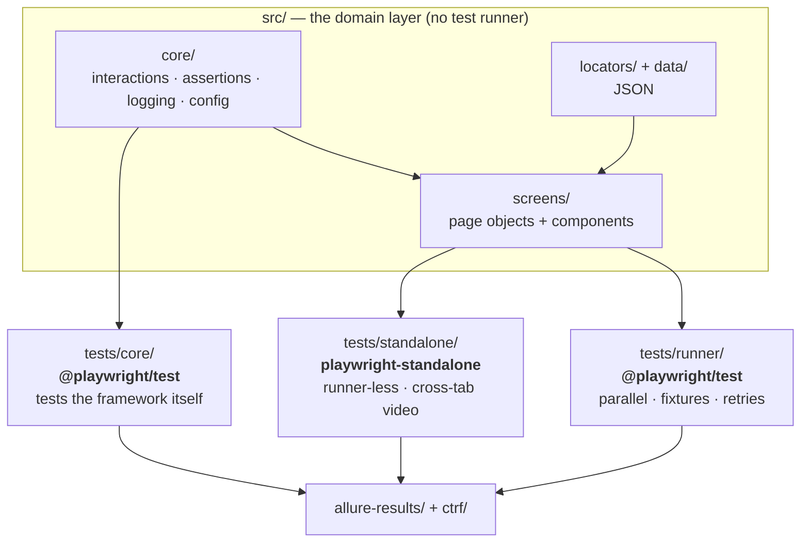

# playwright-e2e-framework

[](https://github.com/BhushanUpwanshi/playwright-e2e-framework/actions/workflows/ci.yml)

A Playwright E2E framework whose page objects are **runner-agnostic** — the same
screens, locators, interactions and test data drive both `@playwright/test`
specs and runner-less journeys.

---

## The idea

Most page-object frameworks are welded to their test runner: screens import the
runner's `expect`, or its fixtures, or its types. That works until you need to
drive the same flows another way — from a monitoring script, a CLI tool, or an
engine that captures something the runner cannot.

Here the domain layer knows nothing about any runner. It depends only on
`playwright`, so two different engines consume it unchanged:



`tests/standalone/checkout.journey.ts` and `tests/runner/checkout.spec.ts` import
the *same* screen modules. Not adapted copies — the same files. That is the whole
claim, and it is enforced by a build check rather than a convention (see
[Design decisions](#design-decisions)).

## What it tests

| Application | Why |
|---|---|
| [Sauce Demo](https://www.saucedemo.com) | A complete e-commerce flow — sign-in, catalogue, cart, checkout, order confirmation |
| [the-internet](https://the-internet.herokuapp.com) | Multi-window and slow-render pages, which exercise what the runner-less engine is for |

## Layout

```
src/
├── core/                  the framework library
│   ├── interactions/      everything that touches a Page
│   ├── assertions/        SoftAssert
│   ├── logging/           logger + the action wrapper
│   └── config/            environment + dataset resolution
├── screens/               page objects, and components/ for shared regions
├── locators/              selectors, one JSON file per screen
└── data/                  environment-keyed test data

tests/
├── core/                  tests for the framework itself
├── runner/                application tests — @playwright/test
└── standalone/            application journeys — playwright-standalone
```

There is no `utils/` folder. Every module under `core/` is named for the one
thing it owns.

## Running it

```bash
npm install
npx playwright install chromium

npm run test              # both Playwright projects — core + e2e
npm run test:core         # the framework's own tests (no network needed)
npm run test:e2e          # the application suite
npm run test:standalone   # the runner-less checkout journey
npm run test:standalone:tabs   # the runner-less cross-tab journey

npm run typecheck
npm run check:layering    # enforces the runner-agnostic rule
npm run report:allure     # build and open the combined Allure report
npm run clean             # drop all generated reports and artifacts
```

`ENV` selects the target environment (`dev` | `qa` | `prod`, default `prod`).

## Design decisions

### The domain layer imports no test runner

`src/` depends on `playwright` for types and nothing else. This is what lets one
set of screens serve two engines — and a convention nobody checks erodes, so
`npm run check:layering` fails the build if any file under `src/` imports
`@playwright/test`. It matches import *statements*, not the bare string, because
several files mention the package in comments explaining this very rule.

### Screens return the next screen

`signIn()` returns an `InventoryScreen`; `checkout()` returns a
`CheckoutInformationScreen`. The flow is typed, so a test cannot call a checkout
method while still on the cart.

Methods come in pairs where both outcomes are legitimate — `signIn` /
`signInExpectingFailure`, `continueWith` / `continueExpectingFailure`. The return
type states which outcome the test expects, instead of the test branching on
whatever came back.

### Soft assertions are shared across a journey and flushed automatically

A checkout journey spans four screens. `SoftAssert` is passed between them rather
than created per screen, so failures aggregate into one report instead of being
lost at each transition.

It only reports when `assertAll()` is called — so a test that collects failures
and forgets that call passes while silently holding them, which looks exactly
like coverage. The `soft` fixture flushes it in teardown, so a test cannot
forget.

### Every interaction is wrapped

`action()` in `core/logging` wraps each interaction, which is why none of them
carry their own `try`/`catch`. It names the attempted action in the failure —
`fill the username field — locator.fill: Timeout 15000ms exceeded`, rather than a
bare timeout that never says which field — and keeps the original error as
`cause`. Re-throwing `new Error(err.message)`, the usual shortcut, discards the
underlying stack.

### Logging goes through a replaceable sink

The interaction layer logs every action. Where those lines belong depends on who
is running the code: a runner-less journey wants stdout, a Playwright spec wants
them attached to the test, and the framework's own tests want them discarded. A
sink keeps that choice with the caller — and keeps `@playwright/test` out of
`core/`.

### Waits are conditions, never sleeps

`core/interactions/waits.ts` has no `sleep()`. A fixed sleep is either longer
than needed — paid on every run by every test — or too short on the one slow CI
run that matters. `waitForStableText` covers the case people reach for one.

Likewise `isVisible` waits rather than reading the DOM once: Playwright's
`locator.isVisible()` answers about the DOM as it stands, and reports an element
one tick from rendering as absent.

### Toggles are set, not clicked

`setToggle(page, selector, true)` asks for a *state*. A click flips, so "enable
this" silently disables an already-enabled control — a failure that depends on
what ran before it, which is the hardest kind to trace.

### Page Object Model, not Screenplay

Screenplay composes better for large journey matrices, and it was considered. POM
was chosen because this suite's flows are short and screen-shaped, and POM keeps
the mapping between a screen and its file obvious to anyone opening the repo.
Components (`screens/components/`) cover the regions that repeat.

### Locators live in JSON

Selectors sit in `src/locators/*.json`, away from the logic that uses them. Both
target applications are fully attributed with `data-test`, so there is no XPath
anywhere and no coupling to CSS classes.

## Reports

Both engines write into the same places, but the two formats need opposite
handling:

- **Allure** writes one file per result and clears nothing, so every engine's
  results land in `allure-results/` and a single report covers all of them.
- **CTRF** is one document per run. Pointing two producers at one file does not
  merge them — the second overwrites the first, silently. Each engine gets its
  own: `ctrf/playwright.json`, `ctrf/checkout/`, `ctrf/cross-tab/`.

```bash
npm run report:allure
```

## Requirements

- Node.js >= 20
- Java (only for generating the Allure HTML report)

## Licence

MIT
